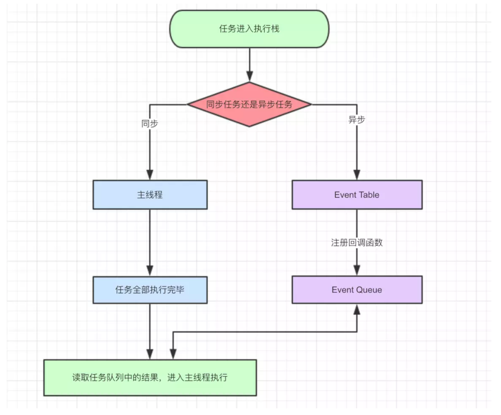

# js线程

## 浏览器线程

- js运作在浏览器中,是单线程的，即js代码始终在一个线程上执行，这个线程称为js引擎线程。
- 浏览器是多线程的，除了js引擎线程，它还有： 
    - UI渲染线程
    - 浏览器事件触发线程
    - http请求线程
    - EventLoop轮询的处理线程
    - ……..
    
## 关于JavaScript 线程
  javascript是一门单线程语言，在最新的HTML5中提出了Web-Worker，但javascript是单线程这一核心仍未改变。所以一切javascript版的"多线程"都是用单线程模拟出来的，一切javascript多线程都是纸老虎！

## 例子

```js
setTimeout(function(){
    console.log('定时器开始啦')
});

new Promise(function(resolve){
    console.log('马上执行for循环啦');
    for(var i = 0; i < 10000; i++){
        i == 99 && resolve();
    }
}).then(function(){
    console.log('执行then函数啦')
});

console.log('代码执行结束');

```
然而输出的是：
```text
马上执行for循环啦
代码执行结束
执行then函数啦
定时器开始啦
```

## 运行机制


导图要表达的内容用文字来表述的话：
- 同步和异步任务分别进入不同的执行"场所"，同步的进入主线程，异步的进入Event Table并注册函数。
- 当指定的事情完成时，Event Table会将这个函数移入Event Queue。
- 主线程内的任务执行完毕为空，会去Event Queue读取对应的函数，进入主线程执行。
- 上述过程会不断重复，也就是常说的Event Loop(事件循环)。

那怎么知道主线程执行栈为空啊？js引擎存在monitoring process进程，会持续不断的检查主线程执行栈是否为空，一旦为空，就会去Event Queue那里检查是否有等待被调用的函数。

 
## 广义的同步任务和异步任务，我们对任务有更精细的定义：
- macro-task(宏任务)：包括整体代码script，setTimeout，setInterval
- micro-task(微任务)：Promise，process.nextTick

事件循环的顺序，决定js代码的执行顺序。进入整体代码(宏任务)后，开始第一次循环。接着执行所有的微任务。然后再次从宏任务开始，找到其中一个任务队列执行完毕，再执行所有的微任务。


## 最后

### js的异步
我们从最开头就说javascript是一门单线程语言，不管是什么新框架新语法糖实现的所谓异步，其实都是用同步的方法去模拟的，牢牢把握住单线程这点非常重要。

### 事件循环Event Loop
事件循环是js实现异步的一种方法，也是js的执行机制。

### javascript的执行和运行
执行和运行有很大的区别，javascript在不同的环境下，比如node，浏览器，Ringo等等，执行方式是不同的。而运行大多指javascript解析引擎，是统一的。

### setImmediate
微任务和宏任务还有很多种类，比如setImmediate等等，执行都是有共同点的。

### 最后的最后
- javascript是一门单线程语言
- Event Loop是javascript的执行机制
## 参考链接
[JavaScript 运行机制详解：再谈Event Loop](http://www.ruanyifeng.com/blog/2014/10/event-loop.html)

[这一次，彻底弄懂 JavaScript 执行机制](https://juejin.im/post/59e85eebf265da430d571f89)

[Node 定时器详解](http://www.ruanyifeng.com/blog/2018/02/node-event-loop.html)
[从浏览器多进程到JS单线程，JS运行机制最全面的一次梳理](https://segmentfault.com/a/1190000012925872#articleHeader6)
